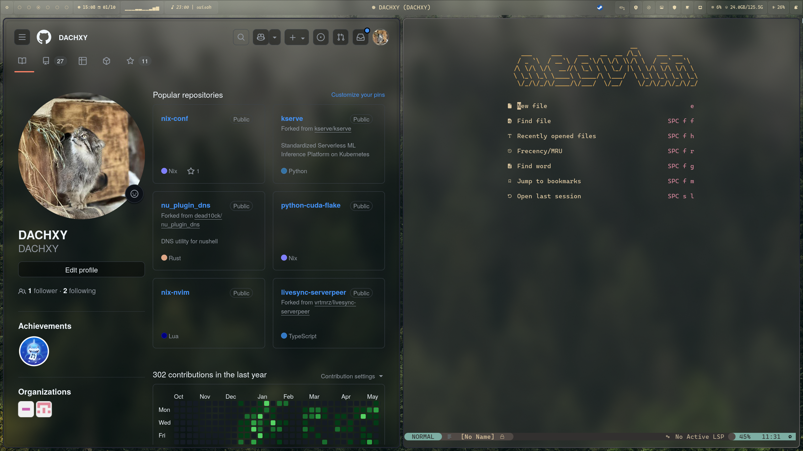

# 🚀 NixOS With Hyprland

---

## 📷 Preview



## ✨ Main Applications

- [x] Hyprland
- [x] NVF
- [x] Waybar
- [x] Hyprlock
- [x] Hypridle
- [x] Zen Browser
- [x] Swaync (Notification Center)
- [x] Swww (Wallpaper)
- [x] Ghostty (Terminal)
- [x] SDDM (Display Manager)
- [x] Fish (shell)
- [x] Rofi (Application Launcher)
- [x] Stylix

## Manuals

- [Hyprland](./docs/hyprland.md)
- [Yazi Extra Shortcuts](./docs/yazi.md)
- [Fcitx5 Input Method (With Bopomofo Tutorial)](./docs/fcitx.md)

## 🎮️ Game

- Steam
- Xbox wireless controller

## 🧠 Virtualization

- Virt Manager (libvirt)
- Windows 11 example config: [win11_kvm.xml](./home/config/vm/win11_kvm.xml)

## ⌨️ Input (Fcitx5)

- Rime (bopomofo, pinyin)
- Mozc (Japanese)

## 🌐 VPN

- Wireguard (You need put your own `wg0.conf` in sops file) .

> NOTE: If import `wireguard.nix` without config file, the Build will fail.

## 🧊 CUDA

See [Python Cuda Flake](https://github.com/DACHXY/python-cuda-flake)

---

## 💿️ Installation

> Your need to add your own device in [flake.nix](./flake.nix), and create
> configuration in [system/dev](./system/dev/) (don't forget the
> `hardware-configuration.nix` generated with `nixos-generate-config`)

### Example

```text
system/dev/
├── <your-device-name>
    ├── boot.nix # You can add extra boot options here 
    ├── default.nix # Import modules you need
    └── hardware-configuration.nix # Your hardware configuration
```

`flake.nix`

```nix
nixosConfigurations = {
  <your-device-name> = nixpkgs.lib.nixosSystem {
    modules = [
      nix-index-database.nixosModules.nix-index
      ./system/dev/<your-device-name>
    ];
    specialArgs = {
      inherit inputs system nix-version;
    };
  };
};
```

### ❄️ Flake

> home manager is configured to rebuild with NixOS

OS Install

```bash
nixos-install --flake .#<your device name>
```

Rebuild Switch

```bash
nixos-rebuild switch --flake .#<your device name>
```
